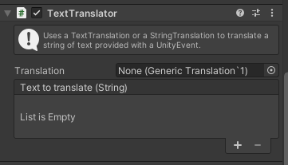
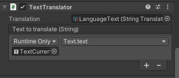

# Apply a translation with a translator component

Translator components can be attached to any game object and used to apply a translation.

If you select any game object in your hierarchy and click on the *Add Component* button, you should see a section called *Hexagon Localization* containing all the components added by the package.

There are three types of translator components, which can apply different types of translations:

* The [TextTranslator](TextTranslator.md) for [String translations](StringTranslation.md) and [Text translations](TextTranslation.md)
* The [SpriteTranslator](SpriteTranslator.md) for [Sprite translations](SpriteTranslation.md)
* The [AudioTranslator](AudioTranslator.md) for [Audio translations](AudioTranslation.md)

Each translator will need a reference to a [translation](CreateTranslation.md) of the right type.

Translators also need to access the value they should translate. This value is passed to them through a Unity Event.

## Update translation

The translator components will update the translation every time the current language in [LanguageSettings](LanguageSettings.md) is updated. It is not needed to change every single translator when the language is changed, it is only necessary to update the language in [LanguageSettings](LanguageSettings.md).

## Script documentation

`public abstract class BaseTranslator : MonoBehaviour`  
The base class from which translators are derived.

`public abstract void Translate();`  
Applies the translation, called when the language setting changes.

#### [Back to index](../README.md)
