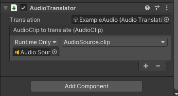

# Audio translator

With an Audio translator, you can translate an AudioClip.

The Audio translator component can be added to any game object with the *Add Component* button.

In the inspector, you will be able to assign it an [Audio translation](AudioTranslation.md).

The translator will also need a Unity Event that uses a dynamic AudioClip to set the value.

In the example below, an Audio translator is used to apply an [Audio translation](AudioTranslation.md) to an AudioSource component.

## Script documentation

`public sealed class AudioTranslator : BaseTranslator`  
Translator class for Audio translations.

`public override void Translate();`  
Applies the Audio translation.

#### [Back to index](../README.md)
