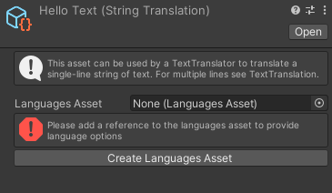
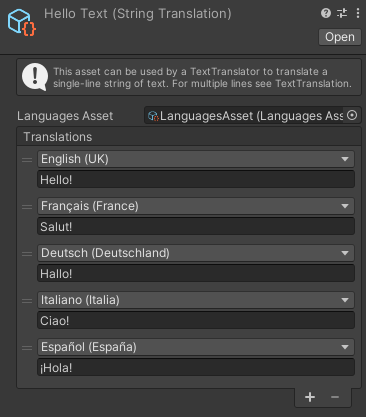

# Create a translation

Translations are assets that can be used by [translator components](ApplyTranslation.md) to apply translations.

As Unity's scriptable objects, they are reusable and easy to manage.

Go to *Assets => Create => Hexagon Localization* and choose between one of the four types of translations.

* [String translation](StringTranslation.md)
* [Text translation](TextTranslation.md)
* [Sprite translation](SpriteTranslation.md)
* [Audio translation](AudioTranslation.md)

## Write translations

If you select the newly created asset in the project window, you should be able to edit it in the inspector.

Every translation asset will need a reference to the [LanguagesAsset](LanguagesAsset.md) to provide language options. You can click on *Create Languages Asset* to create one and then assign it in the inspector.

After adding a reference to the [LanguagesAsset](LanguagesAsset.md) you should be able to add translations to the list. Each translation consists in a language and a translated value.

The language can be chosen with a popup among one of the languages you added in your [LanguagesAsset](LanguagesAsset.md). [Translator components](ApplyTranslation.md) will use this value to choose a translation.

The translated value depends on the type of translation you have chosen. This is the value that will be returned when the translation is applied by a [Translator component](ApplyTranslation.md).

## Script documentation

`public class GenericTranslation<T> : ScriptableObject`  
Base class from which translations are derived.

`public LanguagesAsset languages {get;}`  
Gets the LanguagesAsset from this translation.

`public virtual T Translate(int language);`  
Applies the translation for the given language.

`public virtual T Translate();`  
Applies the translation for the current language in LanguageSettings.

#### [Back to index](../README.md)
