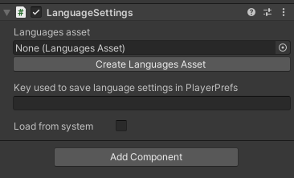
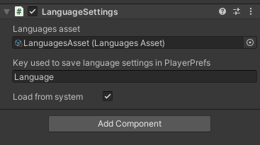

# LanguageSettings component

The LanguageSettings component can be used to modify the current language.
It should be put on any game object in the first scene that is loaded when the game starts or in any scene where the language can be changed.

In the inspector, you will be able to assign it a reference to the [LanguagesAsset](LanguagesAsset.md), which will be used to set the language.
You can create one by clicking on the *Create Languages Asset* button.

The second value to set in the inspector is the key (string value) that will be used to save the language in Unity's PlayerPrefs.
Thanks to this, when the player closes the game and restart it, the same language that was chosen before will be kept.

The third value is a checkbox that, when checked, will try to get the user's system language on start and, if that language is in the [LanguagesAsset](LanguagesAsset.md), it will set it as the current language.
If it is not checked, the default language will be the first one in the list in the [LanguagesAsset](LanguagesAsset.md).

## Modify the current language

The game's language can be changed while the game is running via script or with a UI.Button.

You can [change the game's language]() with the methods `NextLanguage()`, `PreviousLanguage()` and `SetLanguage(int)`.

## Script documentation

`public sealed class LanguageSettings : MonoBehaviour`   
This component class can be used to set the game's language at runtime.

`public static int Language {get;}`   
Gets the game's current language as the index of that language as it appears in [LanguagesAsset](LanguagesAsset.md).

`public void NextLanguage();`   
Changes the index of the current language to the next one. If the current language is the last one in the list, this will set the language's index to 0.

`public void PreviousLanguage();`   
Changes the index of the current language to the previous one. If the current language is the first one in the list, this will set the language's index to the last.

`public void SetLanguage(int index);`   
Changes the index of the current language to a specific index. If the given index is out of bounds, nothing is changed.

#### [Back to index](../README.md)
