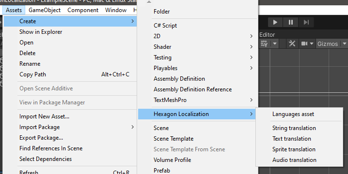
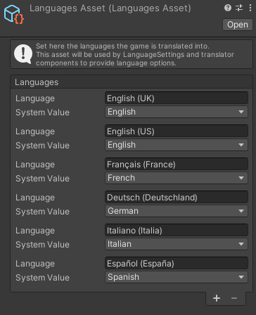

# Add a LanguagesAsset

The LanguagesAsset is the asset that will contain all the languages your game is translated into. You will only need one in your project.

Go to *Assets => Create => Hexagon Localization => Languages asset* to create one.

## Add languages

If you select the newly created LanguagesAsset in the project window, you should be able to edit it in the inspector.

The LanguagesAsset contains a list of languages.  
Each language has a string value called *Language* and an enum value called *System Value*.

The *Language* value can be either the language name, such as "English (United States)", or a language code, such as "en_US". This is the value that will be used when [writing translations](CreateTranslation.md).

The *System Value* value is Unity's built-in *SystemLanguage* and will be used by the [LanguageSettings](LanguageSettings.md) component to select a language depending on the user's system language.

#### [Back to index](../README.md)
