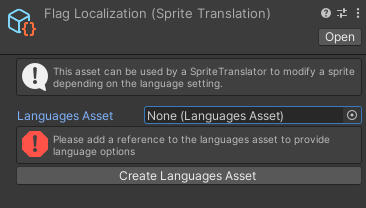
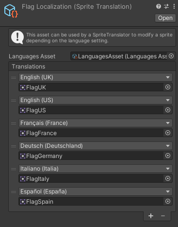

# Sprite translation

A Sprite translation is a type of [translation](CreateTranslation.md) that can modify a Sprite depending on the language settings.

A Sprite translation will need a reference to the [LanguagesAsset](LanguagesAsset.md) to provide language options. You can click on *Create Languages Asset* to create one and then assign it in the inspector.

After adding a reference to the [LanguagesAsset](LanguagesAsset.md) you should be able to add translations to the list. Each translation consists in a language and a reference to a Sprite.

The language can be chosen with a popup among one of the languages you added in your [LanguagesAsset](LanguagesAsset.md). The [SpriteTranslator](SpriteTranslator.md) will use this value to choose a translation.

The Sprite reference will be returned when applying the translation with a [SpriteTranslator](SpriteTranslator.md) component.

#### [Back to index](../README.md)
