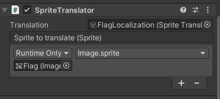

# Sprite translator

With a Sprite translator, you can translate a Sprite.

The Sprite translator component can be added to any game object with the *Add Component* button.

In the inspector, you will be able to assign it a [Sprite translation](SpriteTranslation.md).

The translator will also need a Unity Event that uses a dynamic Sprite to set the value.

In the example below, a Sprite translator is used to apply a [Sprite translation](SpriteTranslation.md) to a UI.Image component.

#### [Back to index](../README.md)
