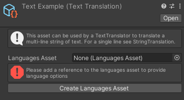
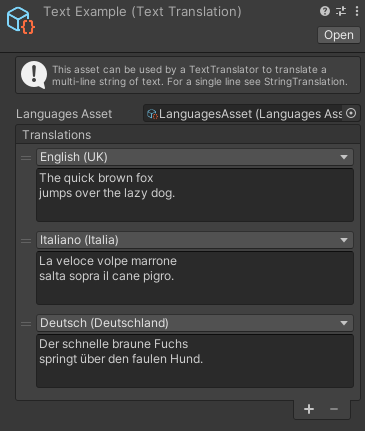

# Text translation

A Text translation is a type of [translation](CreateTranslation.md) that can translate a multi-line string of text.

A Text translation will need a reference to the [LanguagesAsset](LanguagesAsset.md) to provide language options. You can click on *Create Languages Asset* to create one and then assign it in the inspector.

After adding a reference to the [LanguagesAsset](LanguagesAsset.md) you should be able to add translations to the list. Each translation consists in a language and a string value.

The language can be chosen with a popup among one of the languages you added in your [LanguagesAsset](LanguagesAsset.md). [Translator components](ApplyTranslation.md) will use this value to choose a translation.

The string value is the value that will be returned when applying the translation with a [TextTranslator](TextTranslator.md) component.

Differently from a [StringTranslation](StringTranslation.md), this uses a text area instead of a text field.

#### [Back to index](../README.md)
