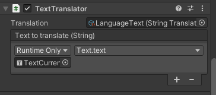

# Text translator

With a Text translator, you can translate a text value.

The Text translator component can be added to any game object with the *Add Component* button.

In the inspector, you will be able to assign it a [String translation](StringTranslation.md) or a [Text translation](TextTranslation.md).

The translator will also need a Unity Event that uses a dynamic string to set the value.

In the example below, a Text translator is used to apply a [String translation](StringTranslation.md) to a UI.Text component.

#### [Back to index](../README.md)
